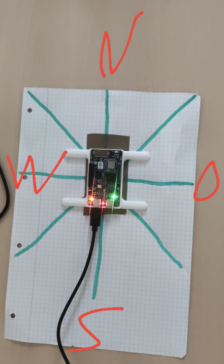
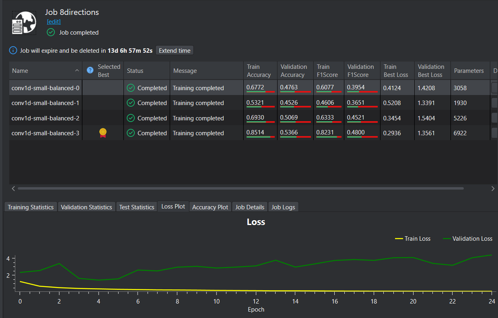
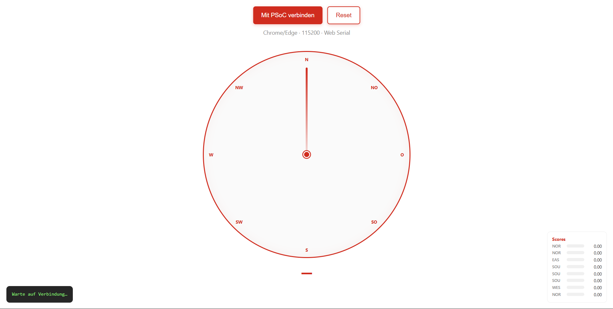

# Siren Direction Detection — PSoC Edge E84 AI Kit

**Infineon EESTech Challenge Hackathon 2026**

| | |
|---|---|
| **Team** | ATomic |
| **Members** | dari, fabi, laurence |
| **Board** | PSoC Edge E84 AI Evaluation Kit (`KIT_PSE84_AI`) |
| **Live-Demo (UI)** | <https://wuhuisland.eu> |
| **Repository** | <https://github.com/dari089/hackatom> |

---

## 1. Projektübersicht

Ziel: Mit zwei Mikrofonen auf dem PSoC Edge AI Kit erkennen, **aus welcher Richtung** ein Sirenen- / Einsatzfahrzeug-Sound kommt.

- **8 Richtungen:** North, Northeast, East, Southeast, South, Southwest, West, Northwest  
- **Zusätzliche Klassen:** `noise`
- **Inferenz:** On-device auf **Arm Cortex-M55** (Edge AI, kein Cloud-Inference zur Laufzeit)  
- **Visualisierung:** Web-Radar (`index.html`) auf [wuhuisland.eu](https://wuhuisland.eu)

---

## 2. Architektur

Sirene → 2× Mikrofon (PSoC) → `audio.c` → ML (CM55) → UART → Browser (`index.html` via Web Serial)

**Hinweis zur Website:** Die Visualisierung ist als **einzelne `index.html`** auf wuhuisland.eu gehostet. Für die Live-Demo wird das Board per **USB** mit dem Laptop verbunden; die Seite liest die Serial-Daten per **Web Serial API** (Chrome/Edge).

---

## 3. Unser Vorgehen (Hackathon)

1. **Setup:** ModusToolbox + DEEPCRAFT Studio installiert; Infineon Deploy-Audio-Beispiel als Basis  
2. **Proof of Concept:** 4 Richtungen, wenig Daten — Workflow (Sammeln → Trainieren → Flashen) verstanden  
3. **Finalmodell:** 8 Richtungen, 26 Sessions, ~10 s pro Aufnahme, je Richtung 3 Messungen (Aufnahmen unter `data/`)
4. **Deployment:** `model.c` + `model.h` in `proj_cm55/model/` ersetzt; `audio.c` für Stereo angepasst  
5. **UI:** Radar-Visualisierung parallel entwickelt und auf wuhuisland.eu veröffentlicht  

---

## Setup & Datensammlung

Das Board wurde auf einem 8-Richtungen-Schema (N, NO, O, …) fixiert. Pro Richtung wurden mehrere ~10 s Sessions mit Sirenen-Sound aufgenommen (DEEPCRAFT Live Data Collection).

*Team ATomic — Mess-Setup für Richtungserkennung (N / S / W / O markiert)*

---

## 4. Modell & Training (DEEPCRAFT Studio)

| Parameter | Wert |
|-----------|------|
| Preprocessor | Contextual Window **1 s**, Shape `[16000, 2]` (Stereo) |
| Architektur | Conv1D **Small** |
| Quantization | Ein (für Code-Generierung) |
| Klassen | 9 (8 Richtungen + noise) |
| Export | `model.c`, `model.h` für PSoC Edge |

**Basis-Beispiel (Infineon):**  
<https://github.com/Infineon/mtb-example-psoc-edge-ml-deepcraft-deploy-audio>

**Deploy-Anleitung:**  
<https://developer.imagimob.com/deepcraft-studio/deployment/deploy-models-supported-boards/deploy-model-PSOC-6-PSOC-Edge>

---

## 5. Firmware-Änderungen

### Dateien in diesem Repo

| Datei | Beschreibung |
|-------|--------------|
| `firmware/audio.c` | Stereo-PDM (2 Kanäle), getrennte ISR, Mic-Gain, UART-Ausgabe |
| `firmware/model/model.c` | Generiertes Modell (DEEPCRAFT) |
| `firmware/model/model.h` | Labels, Buffer-Größen, Schwellwerte |

### Einbindung ins Infineon-Beispiel

1. ModusToolbox: Projekt **PSOC Edge Machine Learning DEEPCRAFT Deploy Audio** für `KIT_PSE84_AI` anlegen/importieren  
2. Ersetzen:
   - `proj_cm55/audio.c` ← unsere `firmware/audio.c`
   - `proj_cm55/model/model.c` + `model.h` ← unsere Modelldateien  
3. **Ganzes Application-Projekt** bauen (nicht nur `proj_cm55`)  
4. **Program/Flash** aufs Board  

---

## 6. Web-Visualisierung

| | |
|---|---|
| **Datei** | `web/index.html` |
| **Hosting** | <https://wuhuisland.eu/> |
| **Funktion** | 8-Richtungen-Radar, Score-Balken, animierter Zeiger |
| **Datenquelle** | Web Serial (Board → Laptop → Browser) |

### Demo starten

1. Board flashen und per USB verbinden  
2. **Chrome oder Edge** öffnen (Web Serial)  
3. <https://wuhuisland.eu> öffnen  
4. Button **„Mit PSoC verbinden“** → KitProg3 COM-Port wählen  
5. Sirenen-Sound abspielen, Radar beobachten  

**Serial-Einstellungen:** 115200 Baud, 8N1

---

## 7. Ergebnisse

| Richtung | Erkennung (subjektiv) |
|----------|------------------------|
| South | Gut |
| East / West | Gut (nach Label-Korrektur in UI) |
| North | Oft als South erkannt |
| Diagonal (NE, SE, SW, NW) | Teilweise |

### Bekannte Limitationen

- **North vs. South:** Zwei **horizontale** Mikrofone unterscheiden „oben/unten“ schlecht; vermutlich wenig Trainingsdaten
- **Wenig Trainingsdaten:**  Modell hat nicht die beste Genauigkeit und springt teilweise zwischen Richtungen
- **Web Serial:** Funktioniert am zuverlässigsten am **PC** mit Chrome

---

## 8. Was wir gelernt haben (Feedback)

- Infineon-Doku und Deploy-Beispiel **früh** nutzen spart viel Zeit  
- DEEPCRAFT: **Validation-Set** manuell prüfen (nicht 0:00 lassen)  
- Preprocessor **1 s** statt 2 s (sonst RAM-Overflow auf dem Board)  
- Erst **PoC mit wenigen Klassen**, dann auf 8 Richtungen erweitern  
- Für bessere North-Erkennung: mehr Daten
- Programme waren teilweise langsam/buggy, was Zeit kostete

---

## 9. Lizenz & Danksagung

- Basiert auf Infineon ModusToolbox Beispielcode (siehe Datei-Header in `audio.c`)  
- ML-Modell trainiert mit **DEEPCRAFT Studio** (Imagimob / Infineon)  
- Hackathon: **Infineon EESTech Challenge**
- Bei Setup, Debugging und Dokumentation haben wir KI-Tools (Gemini/Cursor) als Hilfe genutzt — Entscheidungen, Datensammlung, Training und Flashing haben wir selbst gemacht.

---

## Quick Links

- [Live Radar UI](https://wuhuisland.eu/)  
- [Unser Repository (Team ATomic Trio)](https://github.com/dari089/hackatom)
- [Offizielles Hackathon-Repository (Infineon)](https://github.com/infineon/hackathon)  
- [Infineon Deploy Audio Example](https://github.com/Infineon/mtb-example-psoc-edge-ml-deepcraft-deploy-audio)  
- [DEEPCRAFT Deploy Docs](https://developer.imagimob.com/deepcraft-studio/deployment/deploy-models-supported-boards/deploy-model-PSOC-6-PSOC-Edge)  
- [EESTech Challenge](https://eestec-muc.de/category/eestechallenge/)
